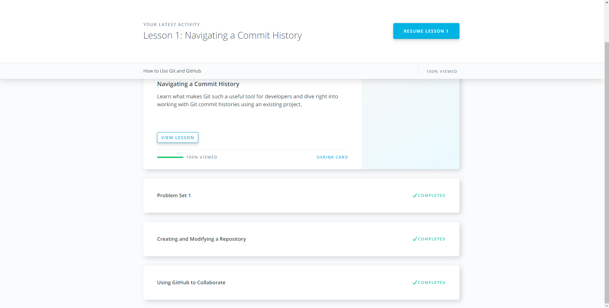
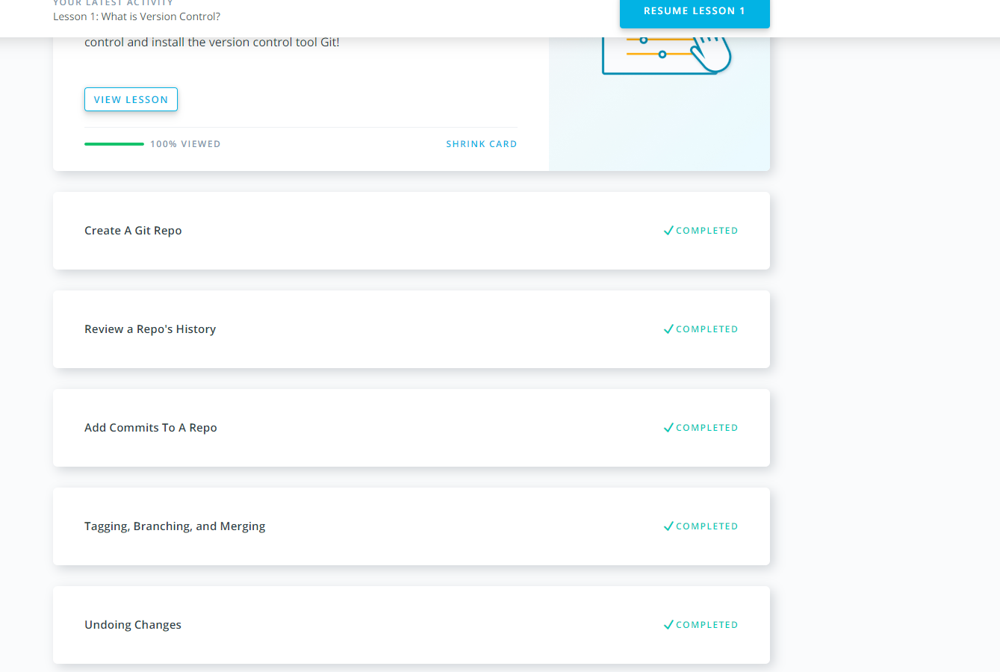
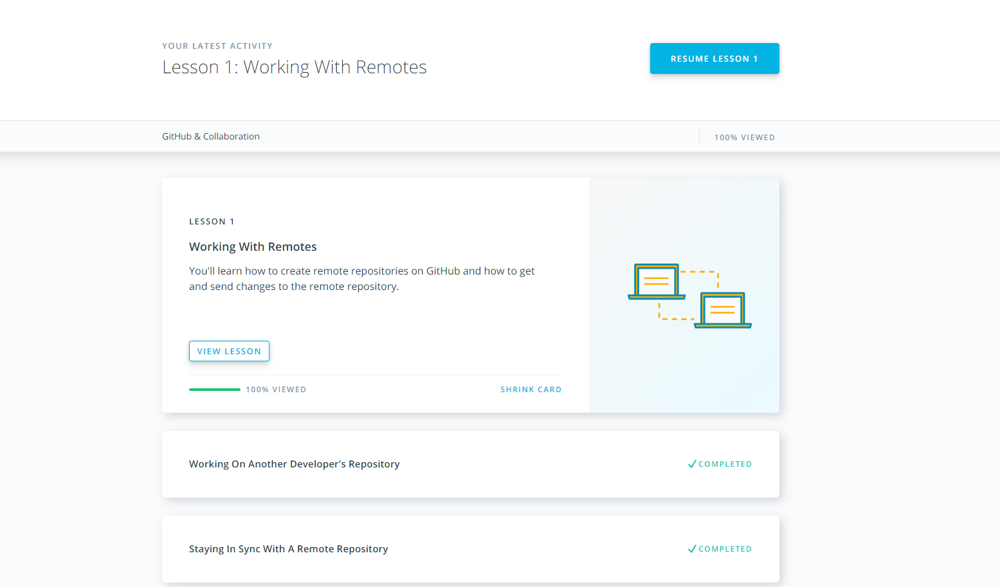
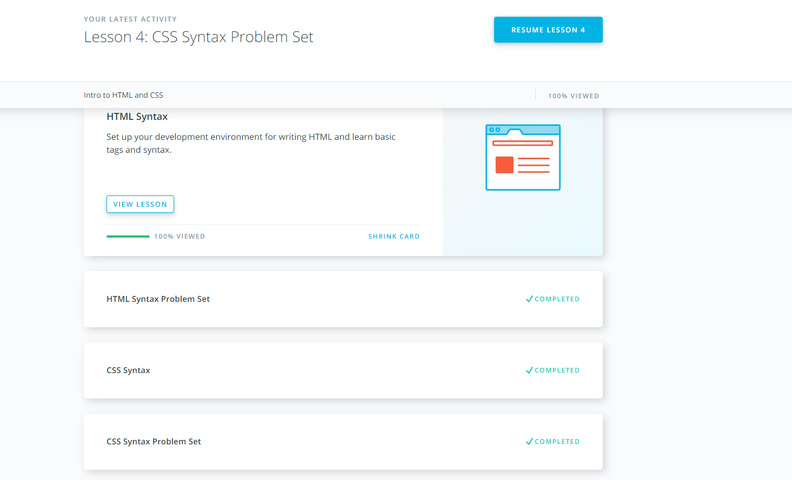
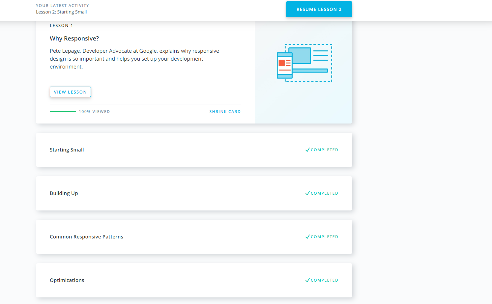
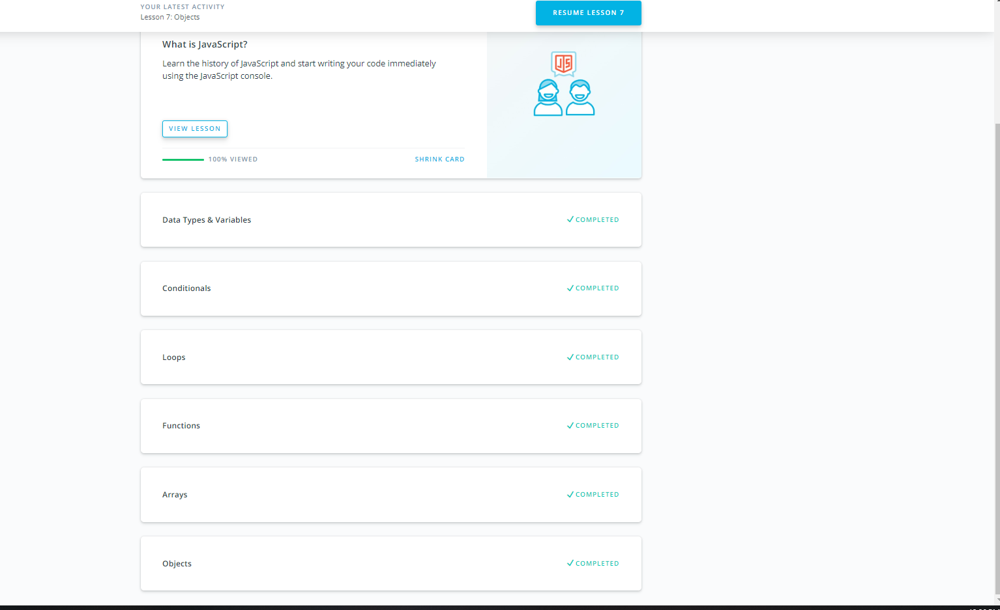

Task_0: Git Basics

Task_1: Linux CLI and Networking - **Done**
 

Task_2: VCS (hello gitty), GitHub and Collaboration - **Done**
 

Task_3: Intro to HTML & CSS - **Done**
 

Task_4: Responsive Web Design Fundamentals - **Done**
                           

Task_5: Js basics - **Done**
 
