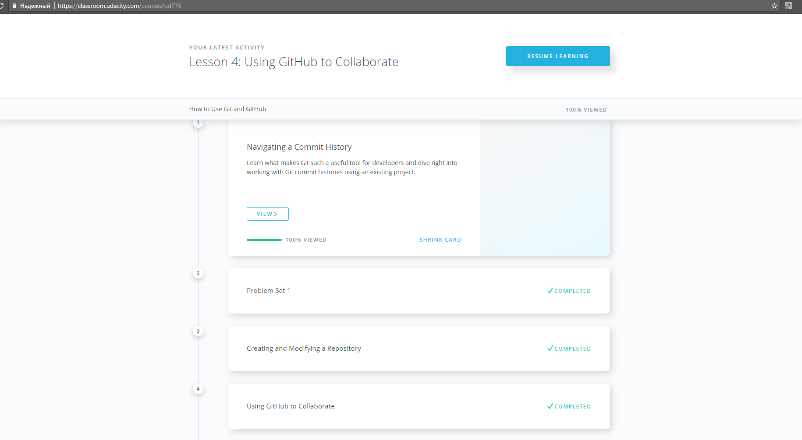
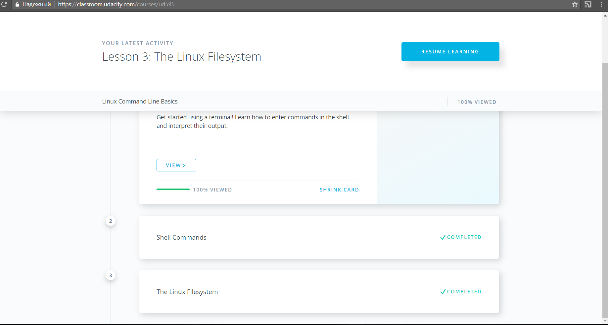
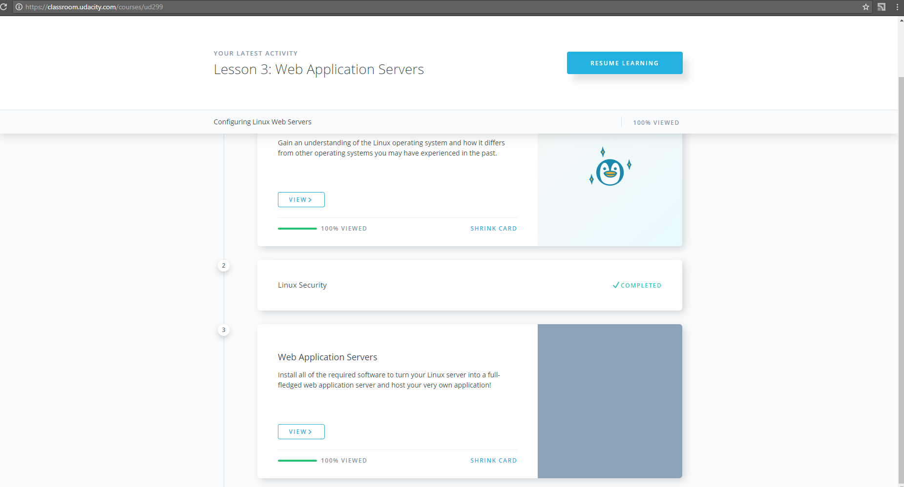
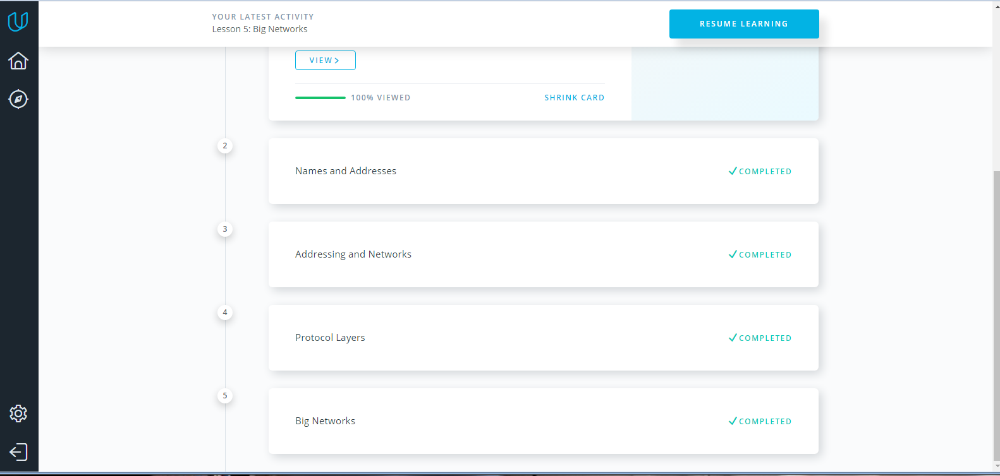
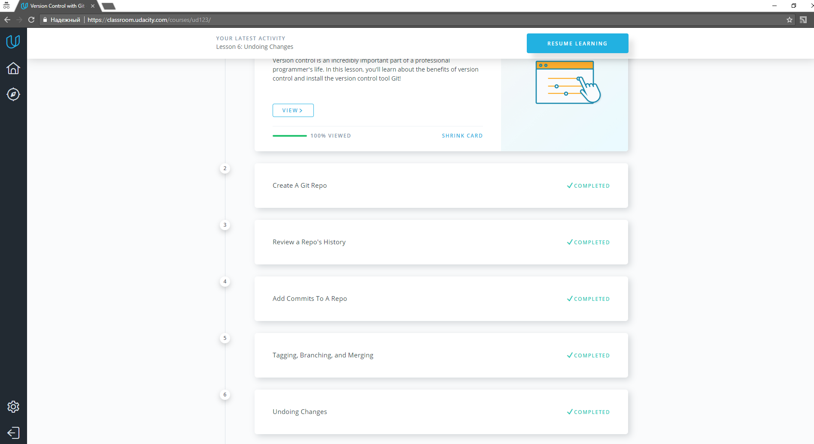
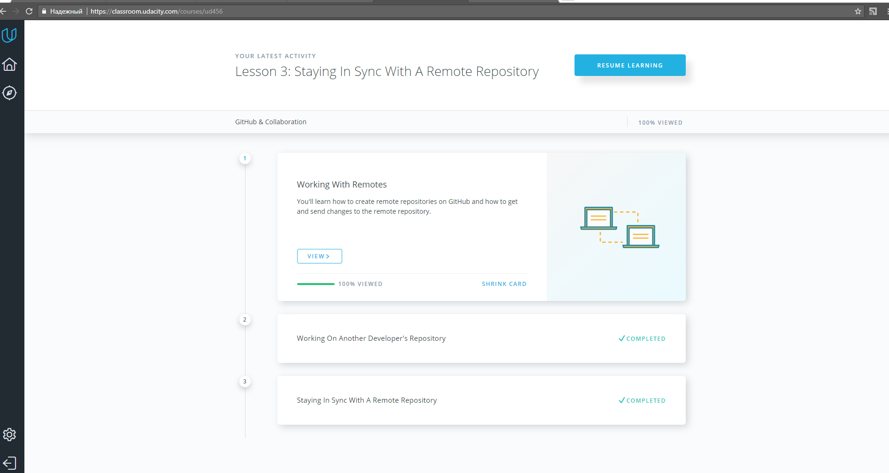

Task_0: How to use Git and GitHub - **Done**

Nice complex course about Git and GitHub basics on Udacity. I had a problems with merging conflicts, making pull requests.
Carry on learning and master skills... - **Done** 

Task_1.1: Linux Command Line Basics 

Task_1.2: Configuring Linux Web Servers - **Done**

Task_1.3: Networking for Web Developers - **Done**
 

Task_2.1: What is Version Control - **Done**
 

Task_2.2: GitHub & Collaboration - **Done**
 
