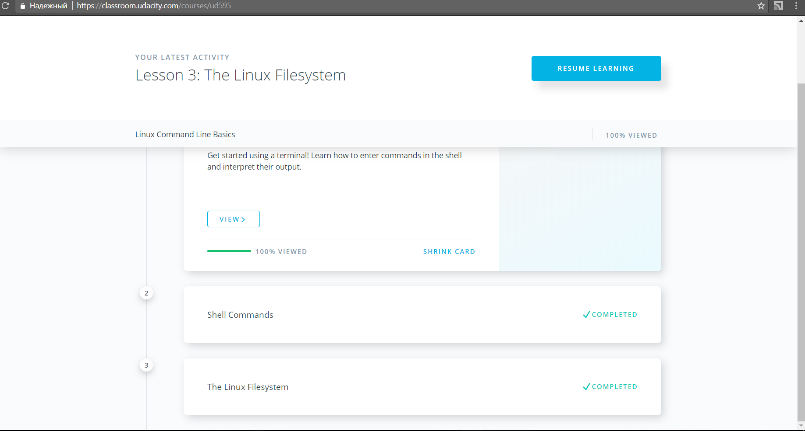
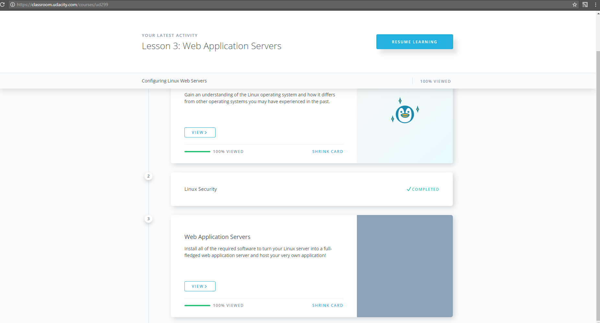
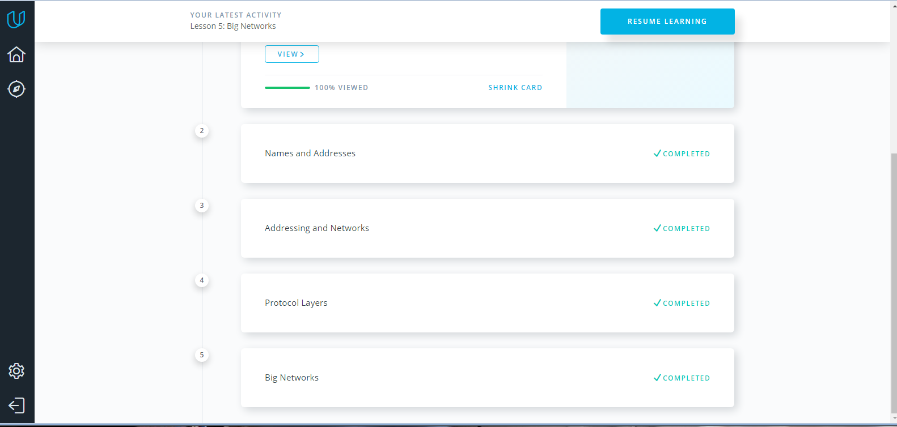
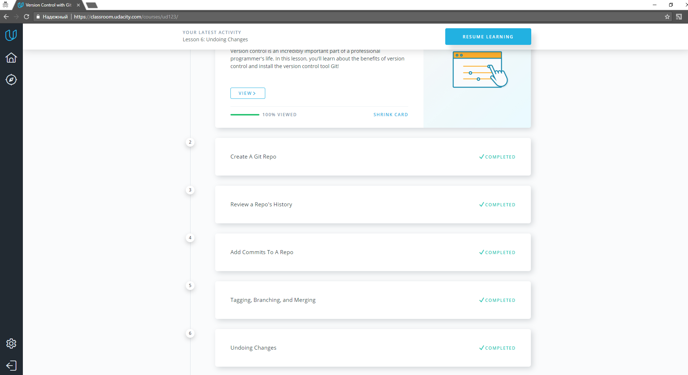
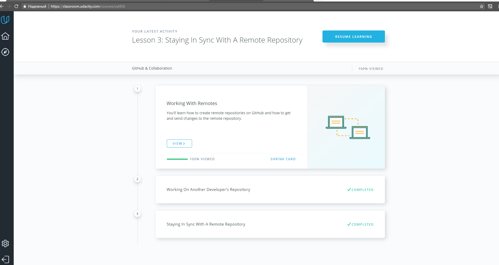
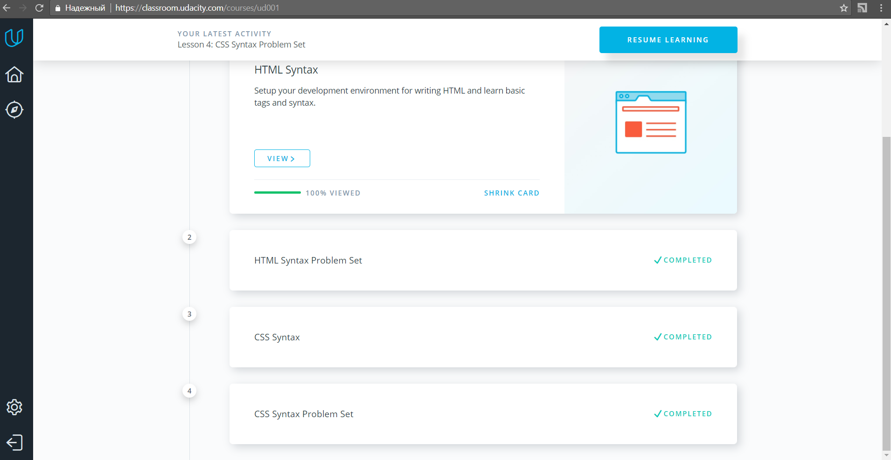

Task_1: Linux Command Line Basics 

Task_2: Configuring Linux Web Servers - **Done**

Task_3: Networking for Web Developers - **Done**
 

Task_2.1: What is Version Control - **Done**
 

Task_2.2: GitHub & Collaboration - **Done**
 

Task_3: Intro to HTML & CSS - **Done**
 

